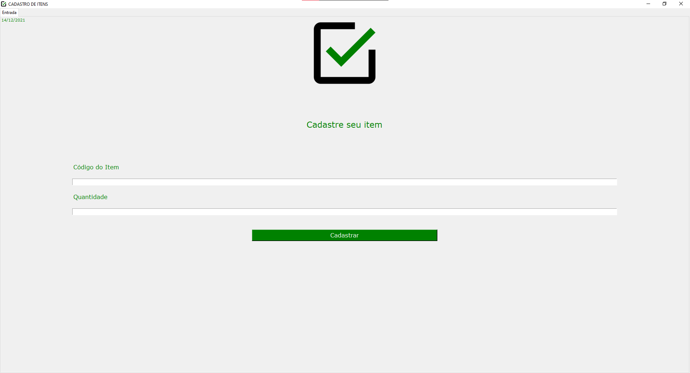
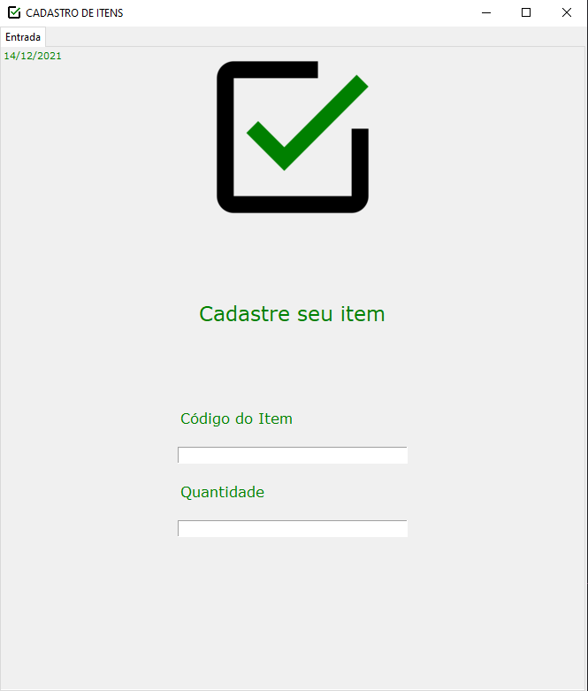

<h1 align="center">Formulário de Cadastro</h1>
<h1 align="center"></h1>

<h3 align="center">Formulário de cadastro de itens em um banco de dados</h2>

---

## 👨‍💻 Technologias Utilizadas
<p display="block" align="left">
  <a href="https://www.python.org/">Python</a>&nbsp;&nbsp;&nbsp;|&nbsp;&nbsp;
  <a href="https://pyautogui.readthedocs.io/en/latest/">pyautogui</a>
  <a href="https://docs.python.org/3/library/tkinter.html">Tkinter</a>
  <a href="https://docs.python.org/3/library/datetime.html">datetime</a>
</p>

## Para rodar a aplicação

Execute ```pip install pyautogui```, ```pip install pyos```, ```pip install pydatetime```, e ```pip install tkinter``` no terminal do seu editor de códigos.

Rode  o projeto no ▶️.

> Obs: Deve-se ter o pip no path como variável de ambiente para instalação
  
## 💻 Desgin
<p align="center">
  
  
</p>

---  

<h4 align="center"> <em>&lt;/&gt;</em> by <a href="https://github.com/PhOmena" target="_blank">PhOmena</a></h4>